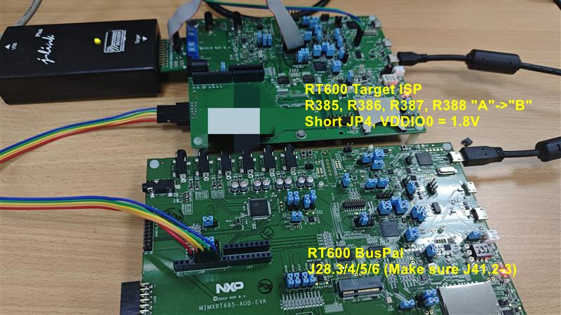

# imxrt-bus-pal
移植 Kinetis blhost bus_pal 应用到 i.MX RT 平台上，可用于测试 RT500/600/700/1180 ROM SPI ISP

# 测试 RT600

用 RT600-AUD-EVK 当作 buspal 测试 RT600（IO 均为 1.8V）
- RT1010-EVK 不可用于测试 RT600，因为 IO 电压仅能 3.3V

# 测试 RT1180

用 RT1010-EVK 当作 buspal 测试 RT1180（IO 均为 3.3V）

